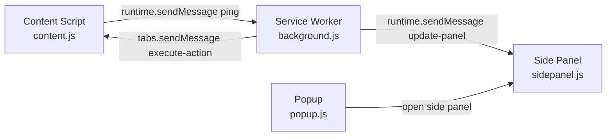
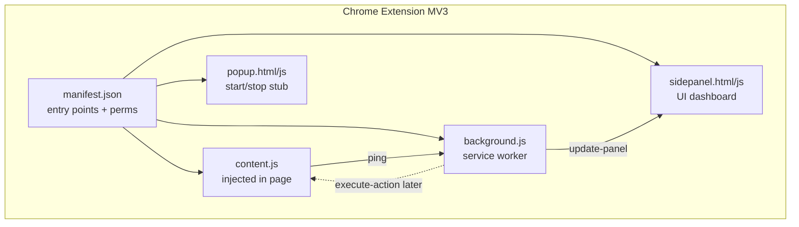

# Requirements

### Overview & Goals

Day 1 (Aug 26) deliverable = **ShieldBrowse Chrome extension skeleton**. No AI yet. No PII logic yet. Just wiring.

Goal: working MV3 extension (built with Vite) where all 3 parts talk to each other:

- **Content script** (runs inside web page)
- **Service worker** (`background.js`, the extension brain)
- **Side panel + popup** (UI surfaces)

End state: click extension icon → side panel opens → content script sends a test message → service worker relays it → side panel shows it. "Message passing verified" = done.

This plan is a **learning plan**. Each stage = concept note + reference link + code snippet + pointer. You (or Gemini) write full code from the snippets. You have zero prior Chrome-extension knowledge, so concepts come first.

### Scope

**In scope (Day 1):**

- Vite + CRXJS project scaffold + folder structure (matches PLAN.md §18 `extension/`)
- `manifest.json` with all entry points (permissions, content script, service worker, side panel, popup, CSP, web-accessible resources)
- Content script that injects + logs + sends a test message
- Service worker that receives, relays, and can send messages back
- Side panel + popup HTML/JS stubs that render received messages
- Load unpacked in Chrome, verify full round-trip message flow

**Out of scope (later days per PLAN.md):**

- DOM Walker extraction logic (Day 2)
- PII regex / NER / detection (Day 2-3)
- Tokenizer, action executor, server, ONNX/vision models (Day 3+)
- Mock hospital site (Core Dev 2, not covered here per your scope choice)
- Any real screenshot / model loading

### User Stories

- As a beginner dev, I want each build step paired with a concept + reference link, so I understand *why* not just *what*.
- As the builder, I want the extension to load in Chrome without errors, so I have a foundation for Day 2 DOM work.
- As the builder, I want to confirm a message travels content script → service worker → side panel, so the whole app's nervous system is proven working before adding features.

### Functional Requirements

1. `npm run dev` (or `build`) produces a loadable extension in `dist/`.
2. Extension loads via `chrome://extensions` (Developer mode → Load unpacked) with zero errors.
3. Content script injects into any page (`<all_urls>`) and logs a marker to the page console.
4. Clicking the toolbar icon opens the side panel.
5. Content script sends a `ping` message; service worker receives it and logs it.
6. Service worker forwards data to the side panel; side panel renders it (proves 3-way messaging).
7. Popup shows a minimal Start/Stop placeholder (no logic yet).

### Non-Functional Requirements

- MV3 only (MV2 deprecated).
- Beginner-readable code: comments on every non-obvious line.
- Folder names match PLAN.md §18 so Day 2+ files drop in cleanly.
- Minimal permissions now (`activeTab`, `sidePanel`, `storage`) — matches PLAN.md privacy framing.

# Technical Design

### Current Implementation

Greenfield. Repo has only docs (`PLAN.md`, `PRD.md`, `Problem_Statement.txt`, `RESEARCH.md`). No `extension/` folder, no `package.json` yet. Day 1 creates the `extension/` module from PLAN.md §18.

### Key Decisions

- **Build tool = Vite + CRXJS Vite Plugin** (`@crxjs/vite-plugin`, v2.x). Chosen because: matches PLAN.md tech stack, needed later for ONNX / npm model imports (Transformers.js, MediaPipe), gives HMR (incl. content scripts), and treats `manifest.json` as single source of truth. Scaffold via `npm create crxjs@latest`.
- **Vanilla JS (no React) for Day 1.** Side panel/popup are trivial stubs; a framework adds noise for a beginner. CRXJS is framework-agnostic, so React can be added later if needed.
- **Messaging = `chrome.runtime` / `chrome.tabs` message API** (per PLAN.md §3.3), not ports. Simpler mental model for first contact.
- **State via `chrome.storage.session`** later (Day 3 tokenizer). Day 1 only needs in-memory + console proof.

### Proposed Changes

Create `extension/` module. Wire the 3-part MV3 architecture (PLAN.md §2.1, §3.3). Nothing AI. The message-passing graph to prove:



### Data Models / Contracts

Message envelope convention (reuse all project) — from PLAN.md §3.3:

```js
// every message = { type, payload }
chrome.runtime.sendMessage({ type: 'ping', payload: { from: 'content', t: Date.now() } });

// content -> service worker
chrome.runtime.sendMessage({ type: 'pii-detected', payload: {/*...*/} });
// service worker -> content script (needs tabId)
chrome.tabs.sendMessage(tabId, { type: 'execute-action', payload: {/*...*/} });
// service worker -> side panel
chrome.runtime.sendMessage({ type: 'update-panel', payload: {/*...*/} });
```

Day 1 only uses `ping` + `update-panel`. Others are stubs/comments for later.

### manifest.json (Day 1 subset)

Use PLAN.md §3.2 as the template. Day 1 keeps everything except you may omit `models/*` / `wasm/*` web-accessible resources until Day 2 (no models yet). Keep:

- `manifest_version: 3`
- `permissions: [activeTab, sidePanel, storage]`
- `host_permissions: [<all_urls>]`
- `background.service_worker + type: module`
- `content_scripts` matching `<all_urls>`, `run_at: document_idle`
- `side_panel.default_path` + `action.default_popup`
- `content_security_policy` (keep now; harmless, needed later for WASM)

Note: with CRXJS, `manifest.json` paths point at your **source** files (e.g. `src/content.js`); the plugin rewrites them on build.

### Components

- **`background.js`** — service worker. Listeners: `chrome.runtime.onInstalled` (log), `chrome.runtime.onMessage` (receive `ping`, relay to panel), open side panel on action click (`chrome.sidePanel.setPanelBehavior({ openPanelOnActionClick: true })`). Note MV3 SW sleeps after ~30s (PLAN.md §3.4) — fine for Day 1.
- **`content.js`** — content script. On load: `console.log('[ShieldBrowse] injected')`, send one `ping`. Later hosts DOM walker.
- **`sidepanel.html/.js/.css`** — renders received `update-panel` payloads into a `<pre>`/list. Day 1 = dumb display.
- **`popup.html/.js/.css`** — Start/Stop buttons, no logic. Placeholder.

### File Structure

Create under project root (aligns with PLAN.md §18):

```
extension/
  manifest.json
  vite.config.js
  package.json
  src/
    background.js        # service worker (Day 1)
    content.js           # content script (Day 1)
    sidepanel.html
    sidepanel.js
    sidepanel.css
    popup.html
    popup.js
    popup.css
  icons/ (16/48/128 png placeholders)
```

Future files from PLAN.md §18 (`dom-walker.js`, `pii-*.js`, `tokenizer.js`, `vision-pipeline.js`, ...) land in `src/` on later days. Not created Day 1.

### Architecture Diagram



### Risks

- **Content-script cannot use most `chrome.*` APIs** (e.g. `captureVisibleTab`) — must ask SW via message. Know this now (PLAN.md §5.5); Day 1 avoids it.
- **SW is not a normal background page** — no DOM, no `window`, module scope, dies when idle. Don't put UI logic there.
- **CRXJS path confusion** — manifest points at `src/` sources, output goes to `dist/`. Always Load Unpacked the `dist/` folder, not project root.
- **HMR quirks** — content-script changes sometimes need extension reload. If message not arriving, reload extension in `chrome://extensions`.

# Learning Guide

### Balanced learning: read these first (30-45 min)

**Chrome extension MV3 basics (must-read, in order):**

- Extensions overview / architecture: https://developer.chrome.com/docs/extensions/develop/concepts/architecture-overview
- What is a **manifest**: https://developer.chrome.com/docs/extensions/reference/manifest
- What is a **content script** (runs in page): https://developer.chrome.com/docs/extensions/develop/concepts/content-scripts
- What is a **service worker** (background brain): https://developer.chrome.com/docs/extensions/develop/concepts/service-workers
- **Message passing** (the Day 1 core skill): https://developer.chrome.com/docs/extensions/develop/concepts/messaging
- **Side panel** API: https://developer.chrome.com/docs/extensions/reference/api/sidePanel
- Load unpacked / dev basics: https://developer.chrome.com/docs/extensions/get-started/tutorial/hello-world

**Vite + CRXJS (the build tool):**

- CRXJS quick start ("90 seconds"): https://crxjs.dev/vite-plugin  (scaffold: `npm create crxjs@latest`)
- CRXJS concepts (manifest, pages, content scripts): same site → Concepts
- Vite basics (only skim): https://vite.dev/guide/

### Mental model (the one paragraph that unlocks it)

A Chrome extension = 3 separate JS worlds that **cannot call each other's functions**. They only pass **messages** (JSON `{type, payload}`). `content.js` lives inside the web page (can touch page DOM, can't use most `chrome.*`). `background.js` (service worker) is the coordinator (can use `chrome.*`, network, but no page DOM, and it sleeps when idle). `sidepanel.js`/`popup.js` are little web pages for UI. Day 1 = build all three empty and prove a message travels between them.

### How to work with Gemini (your code writer)

For each delivery stage below:

1. Read the linked doc + concept note.
2. Give Gemini: the concept, the code snippet from Technical Design, and the exact file path.
3. Ask Gemini to expand the snippet into full file **with comments on each line**.
4. Paste into the file, build, test per the stage's check.
5. Only move to next stage after the check passes.

Prompt template for Gemini:

```
You write ONE file for a Chrome MV3 extension built with Vite + CRXJS.
File: extension/src/<name>
Goal: <copy the stage description>
Constraints: MV3, vanilla JS, ES module, comment every non-obvious line,
no AI/PII logic yet (Day 1 skeleton only).
Here is the reference snippet to expand: <paste snippet>
```

### Reference snippets to learn from (do not just copy — read comments)

Service worker: open side panel on icon click + receive ping:

```js
// background.js — service worker (ES module)
chrome.runtime.onInstalled.addListener(() => console.log('[SB] installed'));
// make toolbar icon open the side panel
chrome.sidePanel.setPanelBehavior({ openPanelOnActionClick: true })
  .catch((e) => console.error(e));
// receive messages from content script, relay to side panel
chrome.runtime.onMessage.addListener((msg, sender) => {
  if (msg.type === 'ping') {
    console.log('[SB] ping from tab', sender.tab?.id, msg.payload);
    chrome.runtime.sendMessage({ type: 'update-panel', payload: msg.payload });
  }
});
```

Content script: prove injection + send ping:

```js
// content.js
console.log('[SB] content script injected into', location.href);
chrome.runtime.sendMessage({ type: 'ping', payload: { url: location.href, t: Date.now() } });
```

Side panel: render what it receives:

```js
// sidepanel.js
const out = document.getElementById('out');
chrome.runtime.onMessage.addListener((msg) => {
  if (msg.type === 'update-panel') {
    out.textContent = JSON.stringify(msg.payload, null, 2);
  }
});
```

# Testing

### Validation Approach

Manual, in Chrome. No automated tests Day 1. Verify each stage's check before continuing. Final gate = full 3-way message round-trip.

### Key Scenarios

1. **Build works** — `npm run build` (or `dev`) creates `dist/` with `manifest.json` + bundled `background`, `content`, `sidepanel`, `popup`.
2. **Loads clean** — `chrome://extensions` → Developer mode ON → Load unpacked → select `dist/` → no red errors; "Service worker" link shows.
3. **Content injects** — open any site (e.g. `example.com`) → page DevTools Console shows `[SB] content script injected`.
4. **Icon opens side panel** — click toolbar icon → side panel opens.
5. **Message round-trip** — reload page → side panel `<pre>` shows the ping payload (url + timestamp). This proves content → SW → side panel.
6. **SW log** — inspect service worker (click "Service worker" in `chrome://extensions`) → console shows `[SB] ping from tab ...`.
7. **Popup renders** — click popup entry (if separate) → shows Start/Stop buttons (no action needed).

### Edge Cases

- Message not arriving → reload extension (content scripts need reload after code change).
- Loaded wrong folder → must load `dist/`, not repo root.
- `chrome.sidePanel` undefined → Chrome too old (need 114+) or `sidePanel` permission missing in manifest.
- SW shows "inactive" → normal; it wakes on next message.

### Test Changes

None (no test framework Day 1). Add a `README` note in `extension/` listing the manual checklist above so Day 2 starts from a verified base. Maps to PLAN.md §20.1 first 3 checkboxes (extension loads, content injects, messaging works).

# Delivery Steps

###   Step 1: Scaffold Vite + CRXJS project and folder structure
A runnable, empty extension builds to `dist/` and matches PLAN.md folder layout.

- Run `npm create crxjs@latest` inside a new `extension/` folder (choose Vanilla JS, JavaScript, Chrome).
- Verify generated `package.json`, `vite.config.js` (with `crx({ manifest })`), and `manifest.json`.
- Reorganize source files into `src/` to match PLAN.md §18 (`background.js`, `content.js`, `sidepanel.*`, `popup.*`).
- Add placeholder `icons/` (16/48/128).
- Run `npm install` then `npm run build`; confirm `dist/` is produced.
- Learn: read CRXJS quick start + Vite guide (links in Learning Guide) before/while doing this.

###   Step 2: Configure manifest.json with all entry points
`manifest.json` declares every MV3 surface and CRXJS resolves them without errors.

- Use PLAN.md §3.2 as the template.
- Set `permissions: [activeTab, sidePanel, storage]`, `host_permissions: [<all_urls>]`.
- Point `background.service_worker` at `src/background.js` with `type: module`.
- Add `content_scripts` matching `<all_urls>`, `run_at: document_idle`, js `src/content.js`.
- Add `side_panel.default_path` and `action.default_popup`.
- Keep `content_security_policy` for later WASM; omit `models/*`/`wasm/*` web-accessible resources for now.
- Learn: read the Chrome manifest + content-script + service-worker concept docs before editing.

###   Step 3: Build content script with DOM injection smoke test
Content script proves it runs inside any page and can emit a message.

- Implement `src/content.js` from the Learning Guide snippet.
- On load: `console.log('[SB] content script injected ...')` and send one `{ type: 'ping', payload: { url, t } }` via `chrome.runtime.sendMessage`.
- Add a comment block reserving this file for the future DOM Walker (Day 2, PLAN.md §4).
- Test: build, load unpacked `dist/`, open any site, confirm the injection log in the page console.
- Learn: read the content-scripts + messaging docs; understand why content scripts can't use most `chrome.*` APIs.

###   Step 4: Build service worker and wire 3-way message passing
Service worker receives content pings, relays to side panel, and opens the panel on icon click.

- Implement `src/background.js` from the Learning Guide snippet.
- Add `chrome.runtime.onInstalled` log and `chrome.sidePanel.setPanelBehavior({ openPanelOnActionClick: true })`.
- Add `chrome.runtime.onMessage` handler: on `ping`, log it and re-broadcast `{ type: 'update-panel', payload }`.
- Add commented stubs for future `execute-action` (via `chrome.tabs.sendMessage`) and `capture-screenshot` (PLAN.md §5.5) so later days have anchors.
- Note MV3 SW idle-death behavior in a comment (PLAN.md §3.4).
- Learn: read the service-worker + messaging docs; understand `runtime.sendMessage` vs `tabs.sendMessage`.

###   Step 5: Build side panel + popup stubs and verify full round-trip
Side panel renders received messages and the complete content -> SW -> panel flow is confirmed.

- Implement `sidepanel.html/.js/.css`: a titled panel with a `<pre id="out">` that renders `update-panel` payloads (snippet in Learning Guide).
- Implement `popup.html/.js/.css`: static Start/Stop/Status placeholder, no logic yet (mirrors PLAN.md §12 layout, minimal).
- Rebuild, reload extension, run the Testing tab checklist: injection log, icon opens panel, ping payload appears in panel, SW console shows the ping.
- Write a short `extension/README.md` with the manual verification checklist so Day 2 starts from a proven skeleton (covers PLAN.md §20.1 first 3 items).
- Learn: read the side panel API doc; confirm Chrome 114+.