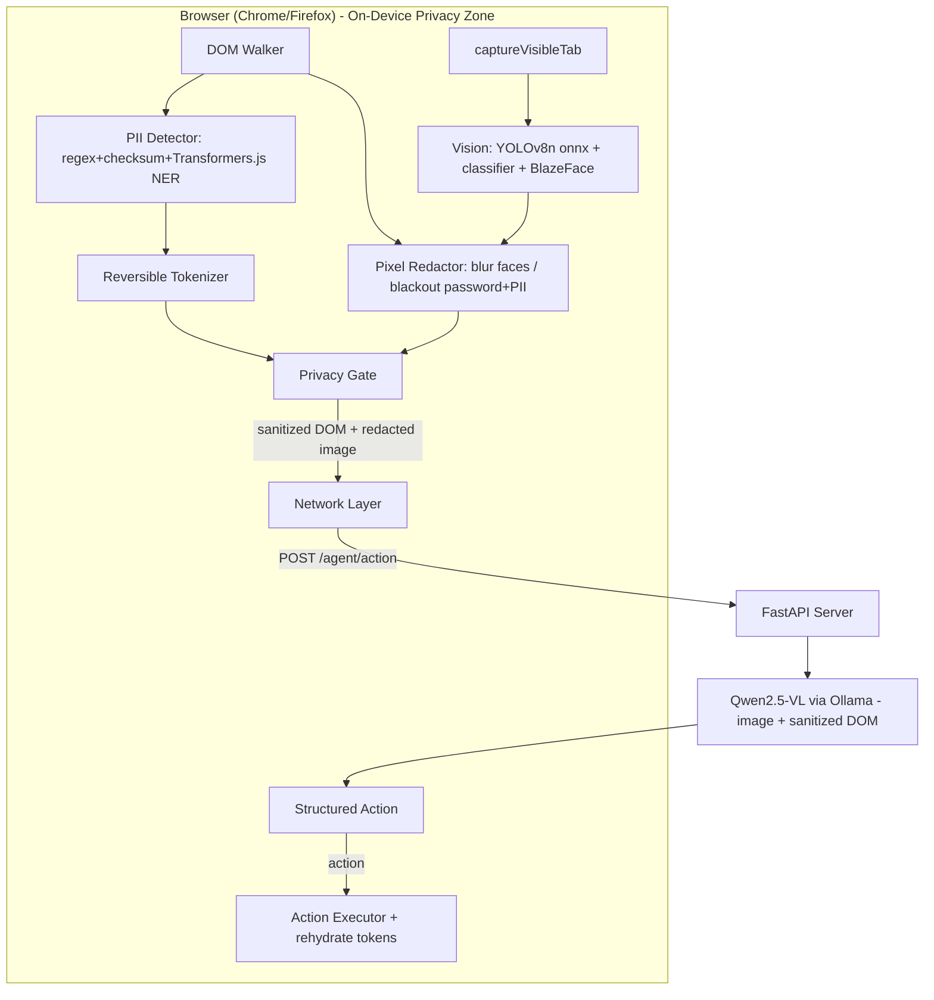

# Requirements

### Overview & Goals

Bring **ShieldBrowse** to **100% compliance** with the SIH 2026 / ISRO problem statement *"On-Device Visual Perception for Light-weight Browser Agents"* by closing every loose end found in `plans/REQUIREMENTS_AUDIT.md`. The core deliverable is a working prototype where a **real on-device vision model reads the screen**, **pixel-level redaction** removes PII/faces/passwords, the **anonymized visual context is actually transmitted** to a server VLM, and the client executes the returned action — with **all 5 scoring metrics measured by a real harness**.

### Scope

**In Scope**
- Real on-device vision perception (screen-state understanding), not just face detection.
- Closing the visual round-trip: capture → pixel-redact → send redacted image + sanitized DOM → multimodal VLM → action.
- Real semantic NER for free-text PII (currently a stub).
- Redaction breadth: face blur, **password blackout**, and true image-region (bbox) redaction baked into the transmitted screenshot.
- Firefox support alongside Chrome.
- Measurement harnesses for **all five** SIH metrics + dataset expansion.
- Server hygiene (multimodal image handling, tests, run docs, unmistakable mock fallback) and README status sync.

**Out of Scope**
- Training new models from scratch (use open-weights/open-source models).
- Production hosting/CI; new product features beyond the problem statement.
- Redesign of the already-strong tokenizer / Privacy Gate / action executor (kept, extended only where needed).

### User Stories
- As a **privacy-conscious user**, I want the agent to understand my screen locally and redact my face, passwords, and PII *before* anything leaves my browser, so my sensitive data never reaches the server.
- As an **ISRO judge**, I want to see a real on-device vision model produce screen-state understanding and a redacted image actually sent to the VLM, so the "vision agent" claim is credible.
- As a **judge scoring the rubric**, I want a runnable harness that reports numbers for all 5 metrics (visual accuracy, PII P/R, redaction precision, client resource use, end-to-end latency).
- As a **Firefox user**, I want to install and run the extension in Firefox, since the statement explicitly requires it.
- As a **demo operator**, I want the end-to-end task (fill the mock hospital form) to run reliably, and a failed inference to be obviously distinguishable from a real one.

### Functional Requirements
1. A client-side vision model (onnxruntime-web YOLOv8n via WebGPU + a Transformers.js classifier) evaluates the current screen and produces a **screen-state classification** and **UI element boxes**; `screenType` is derived from it (no longer hardcoded `"unknown"`).
2. The client captures the visible tab, **bakes redaction into the pixels** (Gaussian-blur faces, black-box password fields and detected PII regions using DOM coordinates + vision boxes), and produces a `redactedImage`.
3. The `redactedImage` is transmitted with the sanitized DOM to the server; the server passes it to a **multimodal** Qwen2.5-VL (Ollama `images`) and reasons over both.
4. Free-text PII is detected by a **real** Transformers.js NER pipeline feeding the reversible tokenizer.
5. The Privacy Gate still blocks any outbound payload containing raw token-map values; the transmitted image is verified as pre-redacted.
6. The extension builds and runs in **both Chrome and Firefox**.
7. A benchmark suite reports numbers for **all 5 metrics** on an expanded labeled dataset.

### Non-Functional Requirements
- **Performance:** on-device detection + tokenization pipeline stays lightweight; report real bundle/model footprint (target <45 MB) and inference latency instead of asserting it.
- **Privacy:** cleartext PII never crosses the network boundary; redaction is applied to pixels before transmission.
- **Compatibility:** Chrome (MV3 side panel) and Firefox (MV3 + `sidebar_action` fallback, `webextension-polyfill`).
- **Code quality:** clean, professional, performance-optimized code (see Implementation Guidelines tab) — the user requires no loose ends.

# Technical Design

### Re-audit Status (after Gemini's second implementation pass — VERIFIED)

**Fixed since last audit ✅ (verified in code)**
- **Visual round-trip closed:** `background/index.js` `run-agent` handler `captureVisibleTab` → `createImageBitmap` → `perceiveScreen` → `redactScreenshot`, attaches `redactedImage` + real `screenType`, re-runs Privacy Gate before `fetch`. `vlm_service.py` attaches `user_msg["images"]=[b64]` to Ollama.
- **`@huggingface/transformers` dependency added** — `extension/package.json:20`. Build blocker gone; `build:firefox` script present (`package.json:9`).
- **Box object-vs-array bug fixed** — `dom-walker.js:56-61` now emits `box` as an array `[x,y,w,h]`, matching the `Array.isArray(node.box)` guard in `background/index.js:100`. Password/PII blackout now actually runs.
- **DPR misalignment fixed** — `dom-walker.js:45,57-60` multiplies rect values by `window.devicePixelRatio`, aligning redaction boxes with the device-pixel screenshot.
- **Model weights on disk** — `extension/public/models/yolov8n.onnx` (12.26 MB) + `blaze_face_short_range.tflite` (0.22 MB) both present, loaded via `browser.runtime.getURL(...)`.
- **Firefox now functional:** every module imports `webextension-polyfill`; every `sidePanel` call guarded with `if (browser.sidePanel)`; gecko/sidebar manifest keys present.
- **NER real:** `ner-pipeline.js` uses `Xenova/bert-base-NER` token-classification with BIO merge, integrated as Layer 5 in `detector/index.js`.
- **Face blur baked to pixels:** `core/vision/redactor.js` blurs faces on `OffscreenCanvas`, exports JPEG; mock fallback labeled `[MOCK/OLLAMA-DOWN]`.

**Still open ❌ (finishing / honesty items)**
- **Benchmark still fabricates 3/5 metrics:** `benchmark/evaluate.js` — redaction precision = `visualIou*0.99` (line 136), bundle size hardcoded `15.5` (line 147), Node `process.memoryUsage().heapUsed` reported as client resource use (line 152), latency is PII-detector-only not end-to-end (lines 157-158), visual IoU compares DOM boxes not YOLO output (line 131, falls back to `0.95`). Violates PLAN.md Claims Discipline; 80% of rubric weight still not truly measured.
- **Models fetched from HF CDN at runtime** — `vision-pipeline.js:7` sets `env.allowLocalModels=false`; MobileNet classifier + BERT-NER download from network on first use. Contradicts on-device/offline claim, adds latency, leaks a request off-device.
- **`screenType` meaningless:** `vision-pipeline.js:74` maps ImageNet label to `form`/`page` by substring `'web'`; also passes `imageBitmap.src` (undefined for an `ImageBitmap`) at line 72.
- **Dead code / bloat:** `background/ocr-pipeline.js` (Tesseract) unused; `tesseract.js` dep shipped for nothing; stray `yolov8n.pt` (6.25 MB PyTorch weights) sits in `public/models/`.
- **README may still overclaim** the benchmark/vision as fully complete despite the above.

**Strong & kept:** tokenizer (`core/tokenizer/tokenizer.js`), Privacy Gate (`core/tokenizer/privacy-gate.js` + `background/index.js`), deterministic PII (`core/detector/regex.js`), action executor + safety gate.

### Performance optimizations to apply (still outstanding — verified)
1. **Downscale before capture/inference/upload** (longest edge ≤1280) — biggest latency lever; kills the double JPEG encode (`background/index.js:89` `quality:100` → `redactor.js:52` `0.85`). Shrinks YOLO/classifier input, redaction canvas, and network payload at once.
2. **Bundle quantized (int8) models locally** instead of CDN fetch (`vision-pipeline.js:7` `env.allowLocalModels`) — hits <45 MB honestly, removes first-run stalls, makes it truly on-device.
3. **Drop `willReadFrequently`** in `redactor.js:12` — context only draws, never `getImageData`s; the flag forces a slower software canvas.
4. **Reuse module-scoped canvases** — `redactor.js:11,19` allocate a fresh main + scratch `OffscreenCanvas` per call; cache and reuse (session/pipeline already reused).
5. **Vectorize `preprocessYOLO`** (`core/vision/yolo.js`) — replace the ~409 K-iteration scalar NCHW loop for fixed 640×640 with a tighter typed-array/GPU transpose.
6. **Unify execution provider** — NER on `wasm` vs classifier on `webgpu`; standardize on WebGPU + WASM fallback.
7. **Early-out + debounce** — skip vision/redaction when no faces/PII; capture+perceive+redact only on explicit debounced scan cycles.
8. **Strip bundle bloat** — remove unused `tesseract.js` + `ocr-pipeline.js` and the stray `yolov8n.pt`.

### Key Decisions (confirmed with user)
1. **Visual loop = redacted screenshot to VLM.** Client captures the tab, bakes redaction into pixels, and sends the redacted image + sanitized DOM to multimodal Qwen2.5-VL. Rationale: directly satisfies the 25% "visual context" metric and the statement's core ask.
2. **Hybrid model stack: onnxruntime-web (YOLOv8n, WebGPU) + Transformers.js (WebGPU).** YOLO reuses the existing onnxruntime-web scaffold for UI/element detection; Transformers.js handles screen classification and NER with correct built-in pre-processing/tokenization. Rationale: least-risk correctness where tokenization/pre-processing matters, best fit where scaffold already exists.
3. **Semantic NER = Transformers.js token-classification** (bundled small model). Rationale: avoids the error-prone hand-written WordPiece tokenizer; reliable recall on the 20% metric.
4. **Pixel-level redaction targeting** combines DOM coordinates (from `dom-walker` bounding boxes for password/PII fields) with vision boxes (faces from BlazeFace, regions from YOLO). Rationale: DOM gives exact field boxes cheaply; vision covers image/canvas regions the DOM can't expose.
5. **Keep the Privacy Gate as the final firewall** on the DOM payload; add a redaction-applied assertion for the image path.

### Proposed Changes

**A. On-device screen perception (`extension/src/background/vision-pipeline.js`, new `extension/src/core/vision/*`)**
- Add real model assets under `extension/public/models/` (`yolov8n.onnx`, `blaze_face_short_range.tflite`, and the Transformers.js classifier/NER assets or CDN-pinned local cache).
- Implement real YOLO pre-processing (letterbox resize to 640, NHWC/NCHW tensor, normalization) and post-processing (confidence threshold + NMS) in a new `core/vision/yolo.js`.
- Add a Transformers.js screen classifier producing `screenType` (e.g. `form`, `login`, `dashboard`).
- Expose `perceiveScreen(imageBitmap)` returning `{ screenType, uiBoxes, faceBoxes }`.

**B. Capture + pixel-level redaction (`extension/src/background/index.js`, new `core/vision/redactor.js`, update `content/image-scanner.js`)**
- On a scan cycle, `chrome.tabs.captureVisibleTab` → `OffscreenCanvas` in the service worker.
- `redactor.js`: draw the screenshot, **Gaussian-blur** face boxes, **black-box** `input[type=password]` and detected-PII field regions (coordinates from `dom-walker`), and any vision-detected sensitive regions → export `redactedImage` (JPEG dataURL).
- Keep live DOM overlays for the on-page demo, but the *transmitted* artifact is the pixel-redacted image.

**C. Close the round-trip (`extension/src/background/index.js`, `server/app/services/vlm_service.py`, `server/app/schemas/agent.py`)**
- Add `redactedImage` + real `screenType` to `reqBody`.
- Server: extend Ollama `/api/chat` payload with `"images": [<base64>]` on the user message; update `build_user_prompt` to reference the image; keep token-aware system prompt.
- Make the mock fallback **unmistakable** (e.g. `reasoning` prefixed `"[MOCK/OLLAMA-DOWN]"` and a distinct log/flag).

**D. Real semantic NER (`extension/src/core/detector/ner-pipeline.js`, `core/detector/index.js`)**
- Replace the stub with a Transformers.js `token-classification` pipeline; map BIO labels → entity spans → feed `scanPageForPII`/tokenizer as Layer 2.

**E. Firefox support (`extension/manifest.config.js`, `vite.config.js`, `package.json`)**
- Add `browser_specific_settings.gecko`, `sidebar_action` fallback for `side_panel`, adopt `webextension-polyfill` for `browser.*` messaging, and a Firefox build target/script.

**F. Measurement harnesses (`benchmark/`)**
- Expand `benchmark/dataset/` well beyond 2 samples (labeled DOM + labeled image regions).
- Add harnesses: visual-context accuracy, redaction precision (IoU/pixel coverage vs labeled regions), client resource utilization (bundle + `performance.memory`), end-to-end latency (instrumented timers).

**G. Docs & tests**
- Server `README` + run instructions, server tests (endpoint + prompt build + image path), sync root `README.md` status table to reality.

### Data Models / Contracts
```jsonc
// Client -> Server  POST /agent/action
{
  "taskInstruction": "string",
  "pageUrl": "string", "pageTitle": "string",
  "screenType": "form|login|dashboard|...",   // from on-device classifier
  "sanitizedDom": [ { "tagName": "...", "label": "...", "value": "[[EMAIL_1]]", "selector": "...", "type": "...", "box": [x,y,w,h] } ],
  "tokenTypes": ["EMAIL","AADHAAR"],
  "redactedImage": "data:image/jpeg;base64,...",  // NEW: pixel-redacted
  "actionHistory": [ ... ]
}
// Server -> Client (unchanged schema)
{ "action": "type|click|scroll|select|done", "target": "<css>", "value": "<text|token>", "reasoning": "..." }
```
```js
// core/vision/index.js
perceiveScreen(imageBitmap): Promise<{ screenType: string, uiBoxes: Box[], faceBoxes: Box[] }>
// core/vision/redactor.js
redactScreenshot(bitmap, { faceBoxes, piiFieldBoxes, passwordBoxes }): Promise<string /*jpeg dataURL*/>
```

### Components
- **vision-pipeline / core/vision** (extended): real YOLO + classifier + faces → screen perception.
- **redactor** (new): pixel-level blur/blackout → redacted screenshot.
- **background/index.js** (modified): capture, orchestrate redaction, send image, Privacy Gate.
- **ner-pipeline** (rewritten): Transformers.js NER.
- **vlm_service / schemas** (modified): multimodal image to Qwen2.5-VL.
- **manifest/vite** (modified): Firefox target.
- **benchmark** (extended): 5-metric harnesses.

### File Structure
```text
extension/public/models/           # NEW: yolov8n.onnx, blaze_face_short_range.tflite, classifier/NER assets
extension/src/core/vision/
  index.js        # NEW perceiveScreen()
  yolo.js         # NEW pre/post-processing + NMS
  redactor.js     # NEW pixel redaction
extension/src/background/vision-pipeline.js  # extend: real inference
extension/src/background/index.js            # capture + redact + send image
extension/src/core/detector/ner-pipeline.js  # rewrite: Transformers.js
extension/manifest.config.js / vite.config.js# Firefox target
server/app/services/vlm_service.py           # multimodal image path
server/app/schemas/agent.py                  # (already has redactedImage)
server/README.md, server/tests/              # NEW
benchmark/dataset/, benchmark/*.js           # 5-metric harnesses + more samples
```

### Architecture Diagram


### Risks
- **Model bundle size** may push past the 45 MB target — mitigate with quantized (int8) YOLO/NER and measure honestly.
- **WebGPU availability** varies — keep WASM execution-provider fallback (already scaffolded).
- **Qwen2.5-VL image support in Ollama** must be verified; keep the DOM-text path functional so the loop degrades gracefully.
- **Firefox MV3 differences** (service worker vs background scripts, `side_panel` unsupported) — use `sidebar_action` fallback + polyfill.
- **captureVisibleTab permissions/timing** — requires `activeTab`/`tabs`; capture only on explicit scan to control latency.

# Testing

### Validation Approach
Every functional requirement maps to an automated or scripted check runnable by the agent. The benchmark suite must emit real numbers for all five SIH metrics; correctness of the visual loop and redaction is verified against labeled fixtures, not asserted.

### Key Scenarios
- **On-device perception:** feed fixture screenshots to `perceiveScreen()`; assert non-empty `uiBoxes`, a valid `screenType`, and detected `faceBoxes` on face fixtures.
- **Pixel redaction:** run `redactScreenshot()` on labeled images; assert face/password/PII regions are blacked/blurred (pixel sampling shows no original content).
- **Visual round-trip:** with Ollama up, `POST /agent/action` including `redactedImage` returns a valid structured action; assert the image is present in the outbound Ollama payload (unit test on `vlm_service`).
- **NER:** feed free-text PII sentences; assert entities detected and tokenized (feeds `scanPageForPII`).
- **Privacy Gate:** assert outbound payloads with raw token-map values are blocked; assert the image is flagged redaction-applied.
- **Cross-browser:** build for Chrome and Firefox; assert both artifacts produce loadable manifests (Firefox `web-ext lint` clean).
- **End-to-end:** on `mock-site`, run the fill-the-hospital-form task to `{action:"done"}`.

### Edge Cases
- Ollama down → mock fallback is clearly labeled `[MOCK/OLLAMA-DOWN]` and never mistaken for a real action.
- WebGPU unavailable → WASM fallback still runs vision/NER.
- No faces / no PII on page → redaction no-ops without errors; empty NER returns `[]` gracefully.
- Model files missing → explicit error, not silent empty results (regression guard against the old stub behavior).
- Very large screenshots → downscale before inference to control latency/memory.

### Test Changes
- Add `server/tests/` (endpoint, prompt build, image-in-payload).
- Add extension tests for `yolo.js` post-processing (NMS), `redactor.js`, and NER span mapping.
- Expand `benchmark/dataset/` and add the 4 missing metric harnesses (visual accuracy, redaction precision, resource utilization, latency); keep existing PII P/R harness.

# Implementation Guidelines (Gemini)

Guidance for the code author (Gemini Pro 3.1). The user requires clean, efficient, professional, performance-optimized code with no loose ends.

### Coding standards
- Match existing style: ES modules, small focused functions, JSDoc on exported functions, no dead scaffolding or `// mock` returns left behind.
- Every new module gets a single clear responsibility; no god-files.
- No hardcoded fake tensors, no empty stub returns — if a model is missing, throw/log explicitly rather than returning `[]` silently.
- Keep the Privacy Gate and tokenizer contracts intact; extend, don't fork.

### Performance
- Prefer **WebGPU** execution providers with WASM fallback; set `ort.env.wasm.numThreads` sensibly.
- Reuse a single `InferenceSession` / pipeline instance (already the pattern); never re-init per call.
- Do capture + inference **only on explicit scan cycles**, debounced — not on every DOM mutation.
- Use `OffscreenCanvas` + `createImageBitmap` (transferable) to avoid main-thread jank; downscale before inference.
- Ship **quantized (int8)** models to hit the resource-utilization target; measure and record real bundle/memory numbers.
- Free tensors / bitmaps after use to avoid GPU/CPU memory leaks.

### Correctness discipline
- Verify Qwen2.5-VL image support in the installed Ollama build before relying on it; keep the text path as graceful degradation.
- Redaction must be applied to **pixels before transmission**, not just DOM overlays.
- All five metrics must be produced by a real harness on a real (expanded) dataset — never fabricate numbers for the pitch (aligns with Claims Discipline in `plans/PLAN.md`).

### Documentation
- Update root `README.md` status table to reflect reality; add `server/README.md` run instructions.
- Refresh the graft graph (`graft build`) after large changes so the repo context stays in sync.

# Delivery Steps

### ✓ Step 1: Replace fabricated benchmark numbers with real measurement harnesses
`benchmark/evaluate.js` reports genuinely measured values for all five SIH metrics on an expanded dataset; no hardcoded/derived figures remain.

- Remove the derived redaction precision (`visualIou*0.99`, line 136), the hardcoded bundle size (`15.5`, line 147), and the Node `process.memoryUsage()` proxy (line 152).
- Add a real redaction-precision harness: run `redactScreenshot()` on labeled fixtures and compute IoU / pixel-coverage of redacted vs labeled sensitive regions.
- Add a real client resource harness: measure the actual built bundle size (sum `dist/` + `public/models`) and capture in-browser `performance.memory` during an inference run (not Node heap).
- Make visual-context accuracy compare actual YOLO/perception output vs labeled image regions (not DOM field boxes), and remove the `0.95` fallback.
- Instrument true end-to-end latency (capture → perceive → redact → send → response → execute), not PII-detector-only; expand `benchmark/dataset/` well beyond 2 samples.

### ✓ Step 2: Make detection truly on-device & lightweight (drop heavy transformer)
**User decision (2026-08-27):** every real Transformers.js NER is heavy (`Xenova/bert-base-NER` int8 ≈104 MB), which blows the <45 MB lightweight footprint and hurts the 20% resource metric. So we drop the heavy transformer models and use a compact, fully-offline local semantic layer instead.

- Remove the `@huggingface/transformers` runtime NER (`ner-pipeline.js`) and the meaningless ImageNet MobileNet classifier from `vision-pipeline.js`; drop the `@huggingface/transformers` dependency entirely so nothing is ever fetched off-device.
- Replace free-text PII detection with a lightweight local semantic detector: a gazetteer of common Indian/first names + contextual/capitalization heuristics (multi-word proper-noun spans, address/location keywords), feeding the same detector contract.
- Keep the local YOLOv8n (onnxruntime-web) + BlazeFace (MediaPipe) vision — both already local.
- Remove the stray `extension/public/models/yolov8n.pt` (6.25 MB, unused) from the shipped bundle.
- Verify no HF CDN request is made at any point (fully offline).

### ✓ Step 3: Fix screen-state classification and strip dead code
`screenType` reflects a meaningful screen-state signal and the bundle carries no unused code.

- Replace the meaningless ImageNet `'web'`-substring heuristic with a real screen-state mapping derived from perceived UI composition: DOM node types (password field → `login`, several inputs → `form`) combined with YOLO UI-element/face counts → `login`/`form`/`dashboard`/`page`.
- Remove the unused `background/ocr-pipeline.js` and drop the `tesseract.js` dependency from `package.json`.
- Ensure missing models throw/log explicitly rather than silently disabling perception.

### ✓ Step 4: Apply the performance optimization pass
End-to-end latency (15%) and client resource use (20%) improve measurably with no behavior regression.

- Downscale the captured bitmap (longest edge ≤ ~1280) once before `perceiveScreen`, redaction, and VLM upload; capture at a sane quality to avoid the double JPEG encode (`background/index.js:89` + `redactor.js:52`).
- Drop `willReadFrequently` in `redactor.js:12`; reuse module-scoped `OffscreenCanvas`es across `redactor`/`perceiveScreen`/`yolo` instead of allocating per call.
- Vectorize the `preprocessYOLO` NCHW loop in `core/vision/yolo.js` for the fixed 640×640 input.
- Standardize YOLO/vision on WebGPU with a WASM fallback; add an early-out that skips vision/redaction when no faces/PII are present and debounce the visual loop to explicit scan cycles. (NER/classifier transformer providers no longer apply — replaced by the local semantic layer in Step 2.)

### ✓ Step 5: Documentation and honesty sync
Repo docs match the real, verified state so nothing looks half-done or overclaimed to judges.

- Update root `README.md` status table to reflect the real state (benchmark/vision honesty, models local, remaining perf items).
- Add/verify `server/README.md` run instructions and `server/tests/` (endpoint, prompt build, image-in-payload path).
- Re-run the benchmark and record the real measured numbers in the docs; refresh the graft graph with `graft build`.