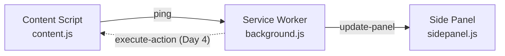

# ShieldBrowse — Extension Architecture & Development

## 🛠️ Day 1 Milestone: Extension Skeleton Verified

The foundational Manifest V3 (MV3) infrastructure is complete and verified:

- **Build System**: Vite 5 + CRXJS Plugin (`@crxjs/vite-plugin`)
- **Content Script (`src/content.js`)**: Injected into all pages, sends real-time page events.
- **Service Worker (`src/background.js`)**: Acts as central message relay and side panel controller.
- **Side Panel (`src/sidepanel.*`)**: Persistent live dashboard receiving messages from active web tabs.
- **Popup (`src/popup.*`)**: Quick action trigger for opening the side panel.

---

## 🚀 Development Workflow

```bash
# 1. Start development mode with Hot Module Reloading (HMR)
npm run dev

# 2. Or create a production build
npm run build
```

### Loading in Google Chrome:

1. Navigate to `chrome://extensions/`
2. Enable **Developer mode** (toggle in upper-right corner).
3. Click **Load unpacked** and select the `extension/dist` folder.
4. Pin the **ShieldBrowse** icon to your toolbar.

---

## 3-Way Message Pipeline



---

## 📅 Roadmap Preview

- **Day 2**: DOM Walker & Structured Accessibility Extraction (`dom-walker.js`) + Regex PII Engine (`pii-regex.js`).
- **Day 3**: Reversible Tokenizer (`tokenizer.js`) & `chrome.storage.session` integration.
- **Day 4**: FastAPI server integration & DOM Action Executor (`action-executor.js`).
